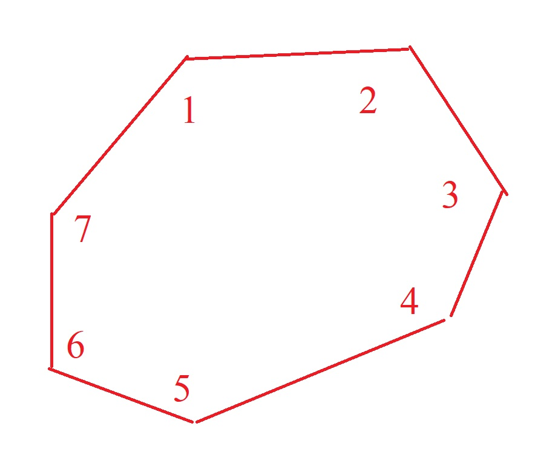

# 130

130. СКП измерения угла одним приёмом составляет 5". 
Рассчитать допустимую невязку в 7-угольнике при измерении углов в 2 приёма.
Углы измерены с одинаковой точностью одним прибором. 

**Дано:**   
m_beta = 5"  
N = 7  
n = 2  


**Найти:**  
f - ?

**Решение:**  





f = 18.7"  
Ответ: 18.7"

**Код на языке С++**  
```c++
#include <iostream>
#include <cmath>

int main()
{
    double N = 7; // angles
    double n = 2; // приёмы
    double m_beta = 5; // seconds

    double f = 2 * sqrt(N / n * pow(m_beta,2));
    std::cout << f << std::endl;   
}
```


